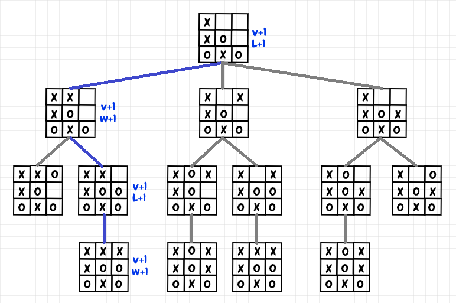

# Monte Carlo Algorithm in Two-Player Games

## Introduction  
The Monte Carlo algorithm is a **game-playing AI technique** that uses random sampling to evaluate moves in two-player games. Instead of exploring every outcome exhaustively like minimax, a Monte Carlo approach plays out many **simulated games (playouts)** from the current position to estimate the strength of each possible move. By averaging the results of these random simulations, the algorithm can **choose the move with the highest win rate or best average outcome**, making it well-suited for complex games where traditional search is impractical. This approach was famously used in algorithms like Monte Carlo Tree Search (MCTS), which achieved breakthroughs in games such as Go.

## How It Works: Random Playouts and Move Evaluation  
At its core, a Monte Carlo game algorithm evaluates moves by **sampling the future**:  
- **Simulate Games for Each Move:** For every legal move from the current state, the algorithm plays out *T* random games (where players make random valid moves until the game ends). These simulations are also called *rollouts* or *playouts*.
- **Track Outcomes:** Each simulation yields a result (win, loss, or draw from the perspective of the player making the move). The algorithm tracks these outcomes for each move. For example, if move A wins 60 out of 100 simulated games, its win rate is 60%.
- **Average the Results:** The performance of a move is assessed by its average outcome over all playouts. In a two-player zero-sum game, this could be the win percentage or a score (e.g. +1 for a win, 0 for a draw, -1 for a loss, averaged over simulations).
- **Select the Best Move:** After simulating many games for each option, the move with the **highest average score or win rate** is selected. Essentially, the algorithm chooses the move that statistically performed best in the simulations.

This Monte Carlo approach does not require a traditional evaluation function. It *derives* an evaluation from raw game outcomes. Given enough simulations, the algorithm's choice converges toward the optimal move (in theory, if infinite playouts were possible, it would find perfect play). In practice, simulations are limited by time, so the results are an approximation. 

## Step-by-Step Example Scenario  
Imagine a simple two-player game scenario to see Monte Carlo in action:  
1. **Current State:** It's X's turn in a tic-tac-toe position. X has two possible moves that look equally good.  
2. **Simulate Move 1:** The algorithm picks the first move for X and then plays random moves for both players until the game ends. Suppose it repeats this 100 times. If 70 out of those 100 random games result in X winning, Move 1 gets a 70% win rate.  
3. **Simulate Move 2:** Next, it simulates 100 games where X starts with Move 2, then continues with random play. Say these playouts yield 40 wins for X, a 40% win rate for Move 2.  
4. **Compare and Choose:** Move 1 had a much higher success rate (70% vs 40%). The Monte Carlo algorithm would therefore choose **Move 1**, expecting it to lead to victory more often. Even without deep strategic reasoning, the algorithm discovers which move is stronger by “learning” from many random trials.

Monte Carlo algorithms often maintain a **game tree** to accumulate results of simulations. Each node in this tree represents a game state and stores statistics (like visit counts and win/loss counts) from playouts that passed through it. The tree starts at the current position (root) and grows as new states are encountered during simulations. By building and updating this tree incrementally, the algorithm refines its estimates for which moves (branches) are most promising as more simulations run.

Illustration of Monte Carlo simulations in a tic-tac-toe game tree. In this diagram, each board state is a node, and a sample playout (the highlighted path) is shown where X eventually wins. The labels "V+1" and "W+1" (or "L+1") indicate how the visit count and win/loss counts are updated for each node along the path after that playout. Blue and gray lines trace the moves of the two players. By accumulating these statistics across many playouts, the algorithm can determine which moves lead to wins more often and thus should be favored in actual play.

## Efficiency and Time Complexity  
One advantage of the Monte Carlo method is that it is an **"anytime" algorithm**: it can run for as long as you allow and typically **gets stronger with more simulations**. Its efficiency is measured by the number of playouts rather than fixed depth:  
- **Best-Case:** If one move is obviously superior (e.g. it quickly leads to a win in many simulations), the algorithm might need only a relatively small number of playouts to identify that move.
- **Worst-Case:** If the game outcomes are very uncertain or evenly matched for all moves, the algorithm may require a large number of simulations to tease out which move is better. 
- **Time Complexity:** Let **N** be the number of simulations and **L** be the average length of each simulated game. A straightforward Monte Carlo search runs in approximately $O(N \times L)$ time.

## Practical Optimizations and Enhancements  
Several optimizations can make Monte Carlo search more effective:  
- **Intelligent Move Selection (UCT):** Balancing exploration and exploitation.  
- **Heuristic Rollouts:** Using domain knowledge to improve the quality of random playouts.  
- **Move Pruning & Sorting:** Allocating more simulations to promising moves.  
- **Parallel Simulations:** Running simulations in parallel to improve speed.  
- **Knowledge Integration:** Combining Monte Carlo with machine learning for better performance.

With these optimizations, Monte Carlo search becomes **more efficient and powerful**. It retains its flexibility and learning-by-simulation approach but converges on strong moves with far fewer trials. Monte Carlo methods have proven extremely effective for two-player games where exhaustive search is infeasible, by intelligently exploring the game through many playouts and honing in on the best strategies.

## References:
【4】 Chessprogramming Wiki. Monte-Carlo Tree Search – Playouts by NN. 
【10】 Wikipedia. Monte Carlo tree search – Principle of operation. 
【15】 Chessprogramming Wiki. Monte-Carlo Tree Search – Pure Monte-Carlo search. 
【41】 Nested Software Blog. Tic-Tac-Toe with MCTS – Selection and UCT. 
【42】 Illustration of Monte Carlo updates in a Tic-Tac-Toe game tree .